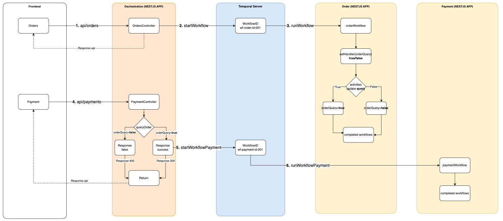

# Temporal for Saga-pattern

## Run with docker
- [x] svc-b (nestJS) node:20-bullseye-slim
- [x] svc-c (nestJS) node:20-bullseye-slim
- [x] orchestration (nestJS) node:20-bullseye-slim

Refer: https://github.com/temporalio/samples-typescript/tree/main/signals-queries

```bash
docker-compose up -d
# Setup nestJs
docker-compose exec svcb bash
yarn

# Setup nestJs
docker-compose exec svcc bash
yarn

# Setup client orchestrations
docker-compose exec orchestration bash
yarn
```

## Context
- Overview


- API Create order. workflows sleep duration 60 seconds. After that worker will setHandle order status 
- API Create Payment. workflows will query order status. If order status is true, Payment will be created


## Explain Flow


### 1. API create order
```bash
curl -XPOST 'localhost:3000/orders' \
-H 'Content-Type: application/json' \
-d '{
  "productId": 30979484,
  "price": 28.99
}'
```
- In orchestration repo, you can see logic in `orderController`
  Api create orders receive data from object and then create order

```typescript
// order.controller.ts
async postOrder(@Body() data: IStoreOrderDto): Promise<{
    status: number;
    orderId: string;
  }> {

    const id: string = (Math.random() + 1).toString(36).substring(2);
    // Create order from request
    const order: IStoreOrderDto = { ...data };
    order.id = id;
    ...

    return {
      status: 200,
      orderId: order.id
    }
  }

```
- You can see the response data from logic above immediate
```bash
{
  status: 200,
  orderId: "001"
}
```

### 2. start workflows orders
- In orchestration repo, you can see logic start worker in `orderController`
```typescript
// order.controller.ts
async postOrder(@Body() data: IStoreOrderDto): Promise<{
    status: number;
    orderId: string;
  }> {
    ...
    // Register workflows
    const handle = await this.temporalClient.start('orderWorkflow', {
      args: [order],
      taskQueue: taskQueueOrder,
      workflowId: 'wf-order-id-' + id,
    });

    console.log(`Started workflow order ${handle.workflowId}`);
    ...
  }
```
- start `orderWorkflow` will send workflow definition to `temporal server` with `workflowId` is `wf-order-id-001` on taskQueue=`ORDER_TASK_QUEUE`

### 3. run workflows orders
- In svcb repo, you can see worker running in `transferWorkerProviders`
```typescript
// app.providers.ts
export const transferWorkerProviders = [
  {
    useFactory: async (activitiesService: Activities) => {
      ...
      const connection = await NativeConnection.connect({
        address: 'temporal:7233',
        // TLS and gRPC metadata configuration goes here.
      });

      const worker = await Worker.create({
        connection,
        taskQueue: taskQueueOrder, // ORDER_TASK_QUEUE
        activities,
        workflowsPath: require.resolve('./temporal/workflows'),
      });

      await worker.run();
      console.log('Started worker!');

      return worker;
    },
  },
];
```
`transferWorkerProviders` will execute workflows activities and update status of order is success or failure

```typescript
// temporal/workflows
export async function orderWorkflow(data: IOrder): Promise<void> {
  let isOrder: boolean = false
  setHandler(isOrderQuery, () => isOrder);
  await new Promise(f => setTimeout(f, 60000));  // Sleep 60 seconds and then update status orderQuery = true
  isOrder = await order(data);
}

````
In the workflows, you can receive data through temporal Server. And then execute business in this flow by activities.


### 4. API create payment

```bash
# API Create Payment 

curl -XPOST 'localhost:3000/payments' \
-H 'Content-Type: application/json' \
-d '{
  "orderId": "001",
  "price": 28.99
}'
```

- In orchestration repo, you can see logic in `paymentController`
  Api create payments receive data from object and then check status orderQuery

```typescript
// payment.controller.ts
async postPayment(@Body() data: IStorePaymentDto): Promise<{
    status: number;
    paymentId: string;
  }> {
    ...
    // Get orderQuery Status from orderWorkflows
    const handleOrder = this.temporalClient.getHandle('wf-order-id-' + data.orderId);
    const orderStatus = await handleOrder.query('isOrder');

    // Return status 400 if order failure
    if (!orderStatus) {
      return {
        status: 400,
        paymentId: payment.id
      }
    }
    ...
    return {
      status: 200,
      paymentId: payment.id
    }
  }

```
- You can see the response data from logic with status 400 if queryOrder is not completed
```bash
{
  status: 400,
  paymentId: "002"
}
```

- If Order is success, Payment will return status 200, and then start new paymentWorkflow for payment business
```bash
{
  status: 200,
  paymentId: "002"
}
```

### 5. Start workflow Payment
- In orchestration repo, you can see logic start worker in `paymentController`
```typescript
// payment.controller.ts
async postPayment(@Body() data: IStorePaymentDto): Promise<{
    status: number;
    paymentId: string;
  }> {
    ...
    
    // Register workflowsPayment if orderQuery success
    const handle = await this.temporalClient.start('paymentWorkflow', {
      args: [payment],
      taskQueue: taskQueuePayment, // PAYMENT_TASK_QUEUE
      workflowId: 'wf-payment-id-' + id,
    });

    console.log(`Started workflow payment ${handle.workflowId}`);

    return {
      status: 200,
      paymentId: payment.id
    }
  }

```
- start `paymentWorkflow` will send workflow definition to `temporal server` with `workflowId` is `wf-payment-id-002` on taskQueue=`PAYMENT_TASK_QUEUE`

### 6. run workflows payments
- In svcc repo, you can see worker running in `paymentWorkerProviders`
```typescript
// app.providers.ts
export const transferWorkerProviders = [
  {
    useFactory: async (activitiesService: Activities) => {
      ...
      const connection = await NativeConnection.connect({
        address: 'temporal:7233',
        // TLS and gRPC metadata configuration goes here.
      });

      const worker = await Worker.create({
        connection,
        taskQueue: taskQueuePayment, // PAYMENT_TASK_QUEUE
        activities,
        workflowsPath: require.resolve('./temporal/workflows'),
      });

      await worker.run();
      console.log('Started worker!');

      return worker;
    },
  },
];
```
`paymentWorkerProviders` will execute workflows activities and handle payment business

```typescript
// temporal/workflows
export async function paymentWorkflow(data: IPayment): Promise<void> {
  await payment(data);
}

````
In the workflows, you can receive data through temporal Server. And then execute business in this flow by activities.


## Development
- Inside `orchestration` start api

```bash
docker-compose exec orchestration bash
yarn start
```

- Inside `svcb` start worker Order

```bash
docker-compose exec svcb bash
yarn start
```

- Inside `svcc` start worker Payment

```bash
docker-compose exec svcc bash
yarn start
```

- Access on browser
```bash
## API orders
curl -XPOST 'localhost:3000/orders' \
-H 'Content-Type: application/json' \
-d '{
  "productId": 30979484,
  "price": 28.99
}'

## API payment
curl -XPOST 'localhost:3000/payments' \
-H 'Content-Type: application/json' \
-d '{
  "orderId": "001",
  "price": 28.99
}'

```


## View dashboard temporal

http://localhost:8088/
