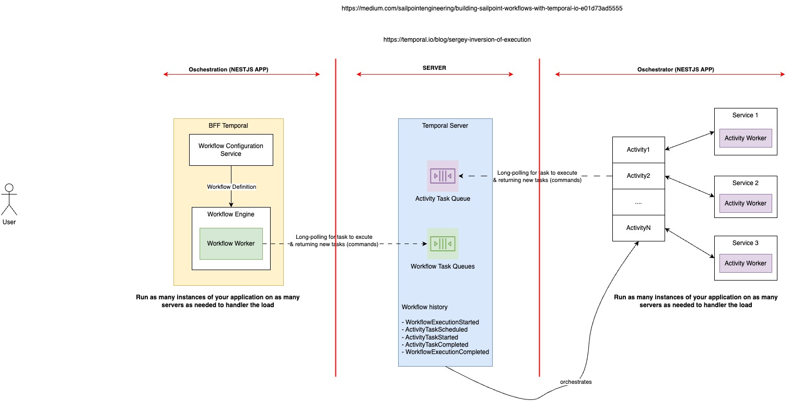
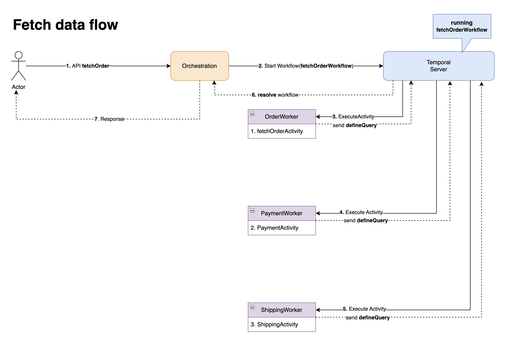
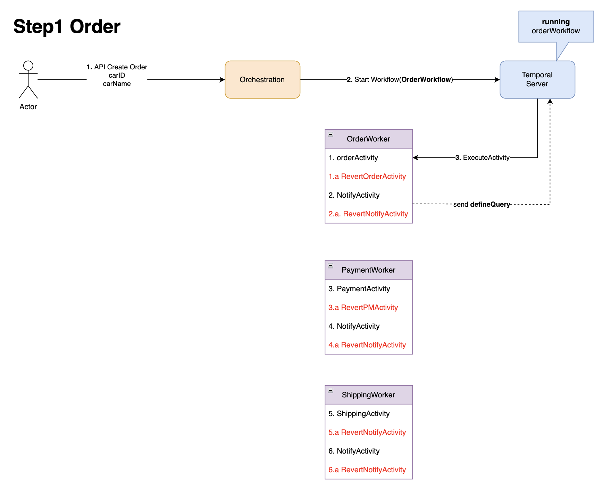
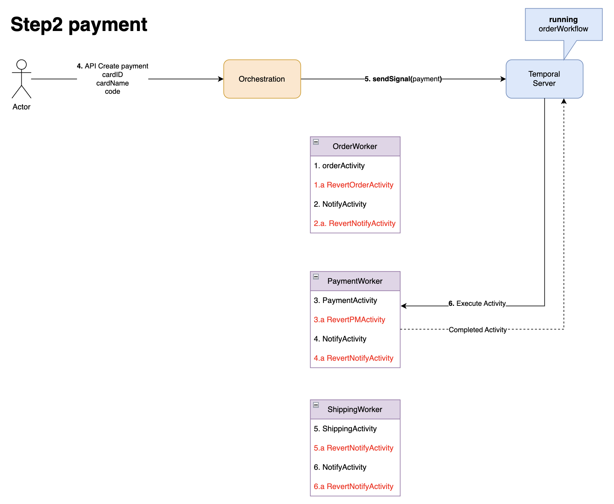
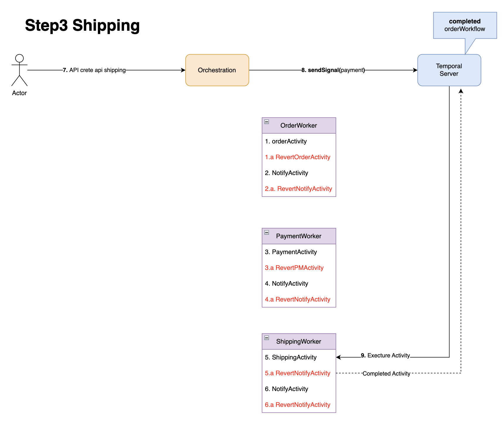

# Temporal for Saga-pattern

## Run with docker
- [x] orchestration (nestJS) node:20-bullseye-slim
- [x] order nestJS node:20-bullseye-slim
- [x] payment nestJS node:20-bullseye-slim
- [ ] shipping nestJS node:20-bullseye-slim

Refer: https://github.com/temporalio/samples-typescript/tree/main/signals-queries

## Development
Please symlink temporal folder into child service

```bash
ln -s order/temporal temporal
ln -s payment/temporal temporal

```

- Inside `orchestration` start api
```bash
cd orchestration
yarn && yarn start
```

- Inside `order` start api
```bash
cd order
yarn && yarn start
```

- Inside `payment` start api
```bash
cd payment
yarn && yarn start
```


## Development with docker

```bash
docker-compose up -d
# Setup nestJs
docker-compose exec order bash
yarn

# Setup nestJs
docker-compose exec payment bash
yarn

# Setup client orchestrations
docker-compose exec orchestration bash
yarn
```

- Inside `orchestration` start api

```bash
docker-compose exec orchestration bash
yarn start
```

- Inside `order` start worker Order

```bash
docker-compose exec order bash
yarn start
```

- Inside `payment` start worker Payment

```bash
docker-compose exec payment bash
yarn start
```

- Access on browser
```bash
## API orders
curl -XPOST 'localhost:3000/orders' \
-H 'Content-Type: application/json' \
-d '{
  "productId": 30979484,
  "price": 28.99
}'

## API payment
curl -XPOST 'localhost:3000/payments' \
-H 'Content-Type: application/json' \
-d '{
  "orderId": "001",
  "price": 28.99,
  "failed": false
}'

```

## View dashboard temporal
http://localhost:8088/

## Context
- Overview


- API Create Order. Start workflows `OrderWorkflow`, Handle orderActivity
- API Create Payment. SignalPayment from `OrderWorkflow`, Handle paymentActivity
- API Create Shipping. SignalShipping from `OrderWorkflow`, Handle shippingActivity


## Explain Flow single step
### API fetch all data from microservice



## Explain Flow multiple step
### 1. Step1: Order

- API create order
```bash
curl -XPOST 'localhost:3000/orders' \
-H 'Content-Type: application/json' \
-d '{
  "productId": 30979484,
  "price": 28.99
}'
```


- In orchestration repo, you can see logic in `orderController`
  Api create orders receive data from object and then create order

```typescript
// order.controller.ts
async postOrder(@Body() data: IStoreOrderDto): Promise<{
  status: number;
  orderId: string;
}> {

  const id: string = (Math.random() + 1).toString(36).substring(2);
  // Create order from request
  const order: IStoreOrderDto = { ...data };
  order.id = id;
  ...

  return {
    status: 200,
    orderId: order.id
  }
}

```
- You can see the response data from logic above immediate
```bash
{
  status: 200,
  orderId: "001"
}
```

- Start orderWorkflow

In orchestration repo, you can see logic start worker in `orderController`
```typescript
// order.controller.ts
async postOrder(@Body() data: IStoreOrderDto): Promise<{
  status: number;
  orderId: string;
}> {
  ...
  // Register workflows
  const handle = await this.temporalClient.start('orderWorkflow', {
    args: [order],
    taskQueue: taskQueueOrder,
    workflowId: 'wf-order-id-' + id,
  });

  console.log(`Started workflow order ${handle.workflowId}`);
  ...
}
```
- start `orderWorkflow` will send workflow definition to `temporal server` with `workflowId` is `wf-order-id-001` on taskQueue=`ORDER_TASK_QUEUE`

- Run worker order
In order repo, you can see worker running in `transferWorkerProviders`
```typescript
// app.providers.ts
export const transferWorkerProviders = [
{
  useFactory: async (activitiesService: Activities) => {
    ...
    const connection = await NativeConnection.connect({
      address: 'temporal:7233',
      // TLS and gRPC metadata configuration goes here.
    });

    const worker = await Worker.create({
      connection,
      taskQueue: taskQueueOrder, // ORDER_TASK_QUEUE
      activities,
      workflowsPath: require.resolve('./temporal/workflows'),
    });

    await worker.run();
    console.log('Started worker!');

    return worker;
  },
}];
```
`transferWorkerProviders` will execute workflows activities and update status of order is success or failure

```typescript
// temporal/workflows
export async function orderWorkflow(data: IOrder): Promise<void> {
  let isOrder: boolean = false
  setHandler(isOrderQuery, () => isOrder);
  await new Promise(f => setTimeout(f, 60000));  // Sleep 60 seconds and then update status orderQuery = true
  isOrder = await order(data);
}

````
In the workflows, you can receive data through temporal Server. And then execute business in this flow by activities.


### 2. Step2: Payment
- API create payment
```bash
# API Create Payment 

curl -XPOST 'localhost:3000/payments' \
-H 'Content-Type: application/json' \
-d '{
  "orderId": "001",
  "price": 28.99,
  "failed": false
}'
```


- In orchestration repo, you can see logic in `paymentController`
  Api create payments receive data from object and then check status orderQuery

```typescript
// payment.controller.ts
async postPayment(@Body() data: IStorePaymentDto): Promise<{
  status: number;
  paymentId: string;
}> {
  ...
  // Get orderQuery Status from orderWorkflows
  const handleOrder = this.temporalClient.getHandle('wf-order-id-' + data.orderId);
  const orderStatus = await handleOrder.query('isOrder');

  // Return status 400 if order failure
  if (!orderStatus) {
    return {
      status: 400,
      paymentId: payment.id
    }
  }
  ...
  return {
    status: 200,
    paymentId: payment.id
  }
}
```
- You can see the response data from logic with status 400 if queryOrder is not completed
```bash
{
  status: 400,
  paymentId: "002"
}
```

- If Order is success, Payment will return status 200, and then start new paymentWorkflow for payment business
```bash
{
  status: 200,
  paymentId: "002"
}
```

- If payment is failure, Order flow should be rollback/compensation all of activities. you can check with api
```bash
curl -XPOST 'localhost:3000/payments' \
-H 'Content-Type: application/json' \
-d '{
  "orderId": "${orderID}",
  "price": 28.99,
  "failed": true
}'
```
- And view response
```bash
# Step1: Create order success
Order ID 6xu0iprfi4, Price +28.99  Success!
# Step2: Create payment failure
[orderWorkflow(wf-order-id-6xu0iprfi4)] Workflow cancelled along with its activity
Compensation Order ID 6xu0iprfi4, Price -28.99 Success!

```


- Start worker Payment
- In orchestration repo, you can see logic start worker in `paymentController`
```typescript
// payment.controller.ts
async postPayment(@Body() data: IStorePaymentDto): Promise<{
    status: number;
    paymentId: string;
  }> {
    ...
    
    try {
      await handle.signal('payment', payment);
      ...
    } catch (err) {
      if (err instanceof WorkflowFailedError) {
        console.log('ERROR OrderWorkflows');
      }
      console.log(`Cancelled orderWorkflow ${handle.workflowId}`);

      throw err;
    }
  }

```
- Signal `payment` will send signal to `temporal server` with `workflowId` is `wf-order-id-001`. And then temporal trigger to payment worker execute activities on taskQueue=`PAYMENT_TASK_QUEUE`
You can see workflow send signal in this code `svc-b/src/temporal/workflows.ts`
```typescript
// workflows.ts`
export async function orderWorkflow(data: IOrder): Promise<void> {
  ...
  // Flow payment step
  setHandler(paymentSignal, async (dataP: IPayment) => {
    try {
      await payment(dataP);
      // successfully called, so clear if a failure occurs later
      compensations.unshift({
        message: 'reversing payment',
        fn: () => revertPayment(dataP),
      });
      await notifyPayment(dataP);
      // successfully called, so clear if a failure occurs later
      compensations.unshift({
        message: 'reversing payment',
        fn: () => revertNotifyPayment(dataP),
      });

      triggerPayment.resolve();
    } catch (err) {
      triggerPayment.reject(err);
    }
  });
  ...
}

```

- In payment repo, you can see worker running in `paymentWorkerProviders`
```typescript
// app.providers.ts
export const transferWorkerProviders = [
  {
    useFactory: async (activitiesService: Activities) => {
      ...
      const connection = await NativeConnection.connect({
        address: 'temporal:7233',
        // TLS and gRPC metadata configuration goes here.
      });

      const worker = await Worker.create({
        connection,
        taskQueue: taskQueuePayment, // PAYMENT_TASK_QUEUE
        activities,
      });

      await worker.run();
      console.log('Started payment worker!');

      return worker;
    },
  },
];
```
`paymentWorkerProviders` will execute workflows activities and handle payment business

```typescript
// temporal/activities.ts
async payment(payment: IPayment): Promise<void> {
  const str: string = `[Payment] ID ${payment.id}, Price +${payment.price} Success!`;
  console.log(str);
  heartbeat();
}
````
In this worker, you can receive data through temporal Server. And then execute business in this flow by activities.

### 3. Step3: Shipping


