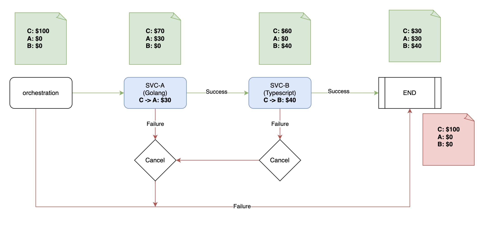

# temporal for saga-pattern

## Run with docker
- [x] svc-a (golang) golang:1.22-alpine3.18
- [x] svc-b (nestJS) node:20-alpine3.18
- [x] workflow (nestJS) node:20-alpine3.18

```bash
docker-compose up -d
# Setup golang
docker-compose exec svca sh
go mod tidy

# Setup nestJs
docker-compose exec svca sh
yarn
```

## Context
```
- C = $100
- A = $0
- B = $0

C -> A = $30
C -> B = $40
-----------------
- C = $30
- A = $30
- B = $40
```



## Development
- Inside `workflow` start api

```bash
docker-compose exec workflow sh
yarn start
```
```typescript
export async function transferWorkflow(
  transferA: ITransfer,
  transferB: ITransfer,
): Promise<void> {
  // Trigger by activities interface to svc-A
  const rsA: Array<string | null> = await TransferMoneyA(transferA);
  // Trigger by activities interface to svc-B
  const rsB: Array<string | null> = await transferMoneyB(transferB);

  console.log(rsB)
  // TODO check results
  setHandler(getTransferQuery, () => rsA);
}
```

- Inside svc start worker A

```bash
docker-compose exec svca sh
go run cmd/worker.go
```

- Inside svc start worker B

```bash
docker-compose exec svcb sh
yarn start
```

- Access on browser
http://localhost:3000/transfers


## View dashboard temporal

http://localhost:8088/
