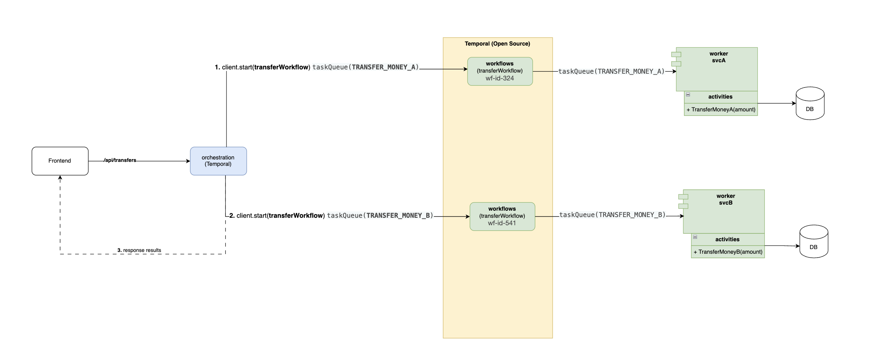

# Temporal for Saga-pattern

## Run with docker
- [x] svc-a (golang) golang:1.22-alpine3.18
- [x] svc-b (nestJS) node:20-bullseye-slim
- [x] orchestration (nestJS) node:20-bullseye-slim

```bash
docker-compose up -d
# Setup golang
docker-compose exec svca sh
go mod tidy

# Setup nestJs
docker-compose exec svcb sh
yarn

# Setup client orchestrations
docker-compose exec orchestration sh
yarn
```

## Context
```
- C = $100
- A = $0
- B = $0

C -> A = $30
C -> B = $40
-----------------
- C = $30
- A = $30
- B = $40
```


## Explain Flow


Have 3 containers in this scenario
- orchestration (containers for coordinator workflows)
- svc-a (worker for will implement workflows)
- svc-b (worker for will implement workflows)

Based on the above process, orchestration is a way to coordinate local transactions so that transactions are executed or rolled back in the correct order. Whether to execute or rollback depends on the orchestrator's requirements.

1. Start workflow `transferWorkflow` on taskQueue `TRANSFER_MONEY_A`. After worker `svc-a` execute completed. It will continue process
2. Start workflow `transferWorkflow` on taskQueue `TRANSFER_MONEY_B`. After worker `svc-b` execute completed. It will continue process
3. After resolved all transactions for each related service. It will response to FE and then notify that the entire process is complete


## Development
- Inside `orchestration` start api

```bash
docker-compose exec orchestration sh
yarn start
```
```typescript
// Start trigger to svc-A
const handleA = await this.temporalClient.start(
    'transferWorkflow',
    {
        args: [paramsA], // pass args to activities of svc-a
        taskQueue: taskQueueA,  // use queueName for trigger to svc-a
        workflowId: 'wf-id-' + Math.floor(Math.random() * 1000),
    },
);
```

- Inside `svca` start worker A

```bash
docker-compose exec svca sh
go run cmd/worker.go
```

- Inside `svcb` start worker B

```bash
docker-compose exec svcb sh
yarn start
```

- Access on browser
http://localhost:3000/transfers


## View dashboard temporal

http://localhost:8088/
